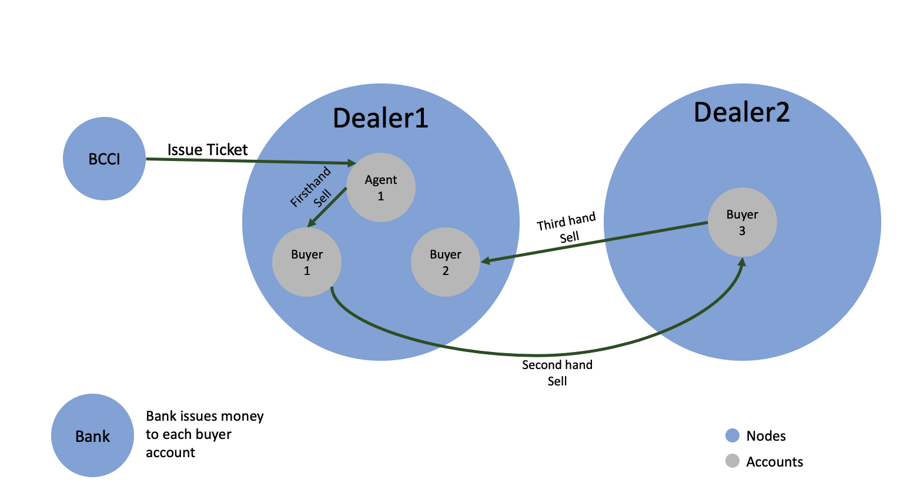

## Introduction
This sample shows you how to integrate accounts and tokens. This sample talks about a scenario where typically when the Cricket season starts, BCCI (Board of Control for Cricket) starts selling tickets.
As of now there are multiple dealers whom the BCCI issues tickets and further these dealers sell tickets to their client. We are trying to simulate similar functionality maintaining the entire issuance and selling
of the tickets on Corda Platform.

## Flow logic of the sample application 

Nodes:

* BCCI node: source of ticket creation. All the tickets in the market are created by this node. 
* Bank Node: souce of money. All the money that is transacted between each individual is issued by this node.
* Dealer1 Node: Dealer Agency 1 and it includes
    * agent1 account: who will get ticket from the BCCI and sell to others. (To demostrate same node account token transaction.)
    * buyer1 account: who will get the ticket from agent1 and later sell to buyer3 (To demostrate cross node account token transaction)
    * buyer2 account: who will buy the ticket from buyer3. 
* Dealer2 Node: Dealer Agency 2 and it includes
    * buyer3 account: who will get the ticket from buyer1 and sell to buyer2

<p align="center">
  
</p>


###  Step 1
```
flow start CreateAndShareAccountFlow accountName: agent1, partyToShareAccountInfoToList: [BCCI, Dealer2]
flow start CreateAndShareAccountFlow accountName: buyer1, partyToShareAccountInfoToList: [Bank, Dealer2]
flow start CreateAndShareAccountFlow accountName: buyer2, partyToShareAccountInfoToList: [Bank, Dealer2]
```
Run the above flow on the Dealer1 node. This will create the agent1, buyer1 and buyer2 accounts on the Dealer1 node and share this account info with BCCI, Bank, and Dealer2 node respecticely.

Then let's go to the Dealer2 node and create buyer3 account: 
```
flow start CreateAndShareAccountFlow accountName: buyer3, partyToShareAccountInfoToList: [Bank, Dealer1]
```

Run the below query to confirm if accounts are created on Dealer1 node. Also run the above query on Bank and BCCI node to confirm if account info is shared with these nodes.

    run vaultQuery contractStateType : com.r3.corda.lib.accounts.contracts.states.AccountInfo


###  Step 2

```
start IssueCashFlow accountName : buyer1 , currency : USD , amount : 10
start IssueCashFlow accountName : buyer3 , currency : USD , amount : 20
start IssueCashFlow accountName : buyer2 , currency : USD , amount : 50
```
Run the above command on the Bank node, which will issue 20 USD to buyer1 account.

###  Step 3
```
flow start QuerybyAccount whoAmI: buyer1
```
You can check balance of buyer1 account at Dealer1's node
[Option] You can also run the below command to confirm if 20 USD fungible tokens are stored at Dealer1's node. The current holder field in the output will be an [AnonymousParty](https://docs.corda.net/docs/corda-os/4.4/api-identity.html#party) which specifies an account.
```
run vaultQuery contractStateType : com.r3.corda.lib.tokens.contracts.states.FungibleToken
```


###  Step 4

    start CreateT20CricketTicketTokenFlow ticketTeam : MumbaiIndiansVsRajasthanRoyals
    
Run the above flow on BCCI's node. BCCI node will create base token type for the T20 Ticket for the match MumbaiIndians Vs RajasthanRoyals. The ticket ID returned from this flow will be needed in the next steps.
You can see your ticket state generated via vault query at the BCCI'd node:


    run vaultQuery contractStateType : com.t20worldcup.states.T20CricketTicket

###  Step 5

    start IssueNonFungibleTicketFlow tokenId : <XXX-XXX-XXXX-XXXXX>, dealerAccountName : agent1

Run the above flow on BCCI's node to issue a non fungible token based off the token type which we created in Step5. You will need to replace the `<XXX-XXX-XXXX-XXXXX>` with the uuid returned from step 6. This token will be issued by the BCCI node to agent1 account on Dealer1 node. 
Switching to the Dealer1's node, you can run the following code to confirm if the token has been issued to the dealer1 account. 
```
flow start QuerybyAccount whoAmI: agent1

```
You can also look for the acutal state that is recoreded by: 

    run vaultQuery contractStateType : com.r3.corda.lib.tokens.contracts.states.NonFungibleToken
Note that, the current holder it will be a key representing the account.


###  Step 6
```
flow start DVPAccountsOnSameNode tokenId: <XXX-XXX-XXXX-XXXXX>, buyerAccountName: buyer1, sellerAccountName: agent1, costOfTicket: 5, currency: USD
```

This is the DVP flow where the buyer(buyer1 account on Dealer1 node) account will pay cash to seller account(agent1 account on Dealer1 node), and the seller account will transfer the ticket token to the buyer. Again, replace the `<XXX-XXX-XXXX-XXXXX>` with the uuid generated in step 6.

### Step 7
Now lets continue the flow logic to intiate an ticket sale between buyer1 and buyer3. Go to Dealer2 node and run the following code:
```
flow start DVPAccountsHostedOnDifferentNodes tokenId: <XXX-XXX-XXXX-XXXXX>, buyerAccountName: buyer3, sellerAccountName: buyer1, costOfTicket: 10, currency: USD

```
Again, We can check for the current vault status by `flow start QuerybyAccount whoAmI: XXXXX`

### Step 8
Lastly, we will finish the flow logic by one last transaction between buyer3(from Dealer2 node) and buyer2(from dealer1 node). Go to the Dealer1 node and run: 
```
flow start DVPAccountsHostedOnDifferentNodes tokenId: <XXX-XXX-XXXX-XXXXX>, buyerAccountName: buyer2, sellerAccountName: buyer3, costOfTicket: 25, currency: USD
```
We can finish the demo with the following query to see how much they each get after the full cycle of sales.
At Dealer1 node
```
flow start QuerybyAccount whoAmI: agent1  
flow start QuerybyAccount whoAmI: buyer1
flow start QuerybyAccount whoAmI: buyer2
```
At Dealer2 node
```
flow start QuerybyAccount whoAmI: buyer3

```
Confirm who owns the [FungibleToken](https://training.corda.net/libraries/tokens-sdk/#fungibletoken) (cash) and [NonFungibleToken](https://training.corda.net/libraries/tokens-sdk/#nonfungibletoken) (ticket) again by running this on Dealer1's node.


## Transfer tokens from one account to other 

For someone who is looking into how to only transfer tokens from one account to other use below steps.


###  Step 1
```
flow start CreateAndShareAccountFlow accountName: agent1, partyToShareAccountInfoToList: [BCCI, Dealer2]
flow start CreateAndShareAccountFlow accountName: buyer1, partyToShareAccountInfoToList: [Bank, Dealer2]
flow start CreateAndShareAccountFlow accountName: buyer2, partyToShareAccountInfoToList: [Bank, Dealer2]
```
Run the above flow on the Dealer1 node. This will create the agent1, buyer1 and buyer2 accounts on the Dealer1 node and share this account info with BCCI, Bank, and Dealer2 node respecticely.

Then let's go to the Dealer2 node and create buyer3 account: 
```
flow start CreateAndShareAccountFlow accountName: buyer3, partyToShareAccountInfoToList: [Bank, Dealer1]
```

Run the below query to confirm if accounts are created on Dealer1 node. Also run the above query on Bank and BCCI node to confirm if account info is shared with these nodes.

    run vaultQuery contractStateType : com.r3.corda.lib.accounts.contracts.states.AccountInfo


###  Step 2

```
start IssueCashFlow accountName : buyer1 , currency : USD , amount : 77

```
Run the above command on the Bank node, which will issue 77 USD to buyer1 account.

###  Step 3
```
flow start QuerybyAccount whoAmI: buyer1
```
You can check balance of buyer1 account at Dealer1's node
[Option] You can also run the below command to confirm if 20 USD fungible tokens are stored at Dealer1's node. The current holder field in the output will be an AnonymousParty which specifies an account.
```
run vaultQuery contractStateType : com.r3.corda.lib.tokens.contracts.states.FungibleToken
```

###  Step 4

    start MoveTokensBetweenAccounts buyerAccountName : buyer1, sellerAccountName : buyer3 , currency : USD , costOfTicket : 10

This will move tokens from account buyer1 to account buyer3


###  Step 5
```
flow start QuerybyAccount whoAmI: buyer1
```
You can check balance of buyer1 account at Dealer1's node
```
run vaultQuery contractStateType : com.r3.corda.lib.tokens.contracts.states.FungibleToken
```

###  Step 6
```
flow start QuerybyAccount whoAmI: buyer3
```
You can check balance of buyer3 account at Dealer2's node
```
run vaultQuery contractStateType : com.r3.corda.lib.tokens.contracts.states.FungibleToken
```
## Further Reading

For accounts visit https://github.com/corda/accounts.

For tokens visit https://github.com/corda/token-sdk.

dataSourceProperties = {
dataSourceClassName = "org.postgresql.ds.PGSimpleDataSource"
dataSource.url = "jdbc:postgresql://127.0.0.1:5432/token_account_dvp_bank"
dataSource.user = "cordauser2"
dataSource.password = "123456"
}

dataSourceProperties = {
dataSourceClassName = "org.postgresql.ds.PGSimpleDataSource"
dataSource.url = "jdbc:postgresql://127.0.0.1:5432/token_account_dvp_bcci"
dataSource.user = "cordauser2"
dataSource.password = "123456"
}

dataSourceProperties = {
dataSourceClassName = "org.postgresql.ds.PGSimpleDataSource"
dataSource.url = "jdbc:postgresql://127.0.0.1:5432/token_account_dvp_dealer1"
dataSource.user = "cordauser2"
dataSource.password = "123456"
}

dataSourceProperties = {
dataSourceClassName = "org.postgresql.ds.PGSimpleDataSource"
dataSource.url = "jdbc:postgresql://127.0.0.1:5432/token_account_dvp_dealer2"
dataSource.user = "cordauser2"
dataSource.password = "123456"
}

dataSourceProperties = {
dataSourceClassName = "org.postgresql.ds.PGSimpleDataSource"
dataSource.url = "jdbc:postgresql://127.0.0.1:5432/token_account_dvp_notary1"
dataSource.user = "cordauser2"
dataSource.password = "123456"
}

dataSourceProperties = {
dataSourceClassName = "org.postgresql.ds.PGSimpleDataSource"
dataSource.url = "jdbc:postgresql://127.0.0.1:5432/token_account_dvp_notary2"
dataSource.user = "cordauser2"
dataSource.password = "123456"
}


CREATE DATABASE token_account_dvp_bank WITH OWNER=cordauser2 ENCODING='UTF-8';
grant all privileges on database token_account_dvp_bank to cordauser2;

CREATE DATABASE token_account_dvp_bcci WITH OWNER=cordauser2 ENCODING='UTF-8';
grant all privileges on database token_account_dvp_bcci to cordauser2;

CREATE DATABASE token_account_dvp_dealer1 WITH OWNER=cordauser2 ENCODING='UTF-8';
grant all privileges on database token_account_dvp_dealer1 to cordauser2;

CREATE DATABASE token_account_dvp_dealer2 WITH OWNER=cordauser2 ENCODING='UTF-8';
grant all privileges on database token_account_dvp_dealer2 to cordauser2;

CREATE DATABASE token_account_dvp_notary1 WITH OWNER=cordauser2 ENCODING='UTF-8';
grant all privileges on database token_account_dvp_notary1 to cordauser2;

CREATE DATABASE token_account_dvp_notary2 WITH OWNER=cordauser2 ENCODING='UTF-8';
grant all privileges on database token_account_dvp_notary2 to cordauser2;


psql -d token_account_dvp_bank -U cordauser2

Drop database token_account_dvp_bank;
Drop database token_account_dvp_bcci;
Drop database token_account_dvp_dealer1;
Drop database token_account_dvp_dealer2;
Drop database token_account_dvp_notary;

# sharding-demo


#token account DVP demo
#student and school(canten) accounts on the same node


#on School node
#student accounts
flow start CreateAndShareAccountFlow accountName: 00000001, partyToShareAccountInfoToList: [Bank]
flow start CreateAndShareAccountFlow accountName: 00000002, partyToShareAccountInfoToList: [Bank]

#canten accounts
flow start CreateAndShareAccountFlow accountName: C0000001, partyToShareAccountInfoToList: [Bank, Student] 

run vaultQuery contractStateType : com.r3.corda.lib.accounts.contracts.states.AccountInfo


#on Bank node
start IssueEHKDFlows$Initiator  accountName : 00000001 ,  amount : 1000
start IssueEHKDFlows$Initiator  accountName : 00000002 ,  amount : 1000

start IssueMealTicketFlows$Initiator  accountName : M0000001 ,  quantity : 10

#on School node, perform dvp
#start DVPAccountsOnSameNode quantityOfTicket: 1, buyerAccountName: 00000001, sellerAccountName: M0000001, costOfTicket: 1

run vaultQuery contractStateType : com.r3.corda.lib.tokens.contracts.states.FungibleToken

#on Student node
start MoveTokensBetweenAccounts buyerAccountName: 00000001, sellerAccountName: C0000001, currency: "USD", quantity: 1

#http endpoint
http://localhost:8080/token/createAccountForStudent?accountName=ST00000001
http://localhost:8080/token/createAccountForSchool?accountName=CA00000001
http://localhost:8080/token/issueEHKDForBank?accountName=ST00000001&amount=10000
http://localhost:8080/token/moveTokensBetweenAccounts?fromAccountName=ST00000001&toAccountName=CA00000001&quantity=1

#比较1个notary shard和10个shard的tps
#场景1，分别issue 100000 个ehkd和10000个bond到其中一个notary0，然后做dvp，得到其tps
#场景2，有10个notary(notary0-notary9), 将100000 个ehkd和10000个bond平均issue 到10个分片,
dvp时由ehkd确定notary，拿出当前notary到bond，然后dvp
比较上述两个场景到tps，
移动ehkd和bond到算法可以以后补充，如何
